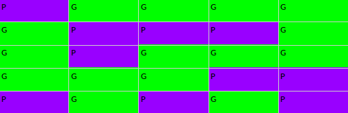

# Gerrymandering

A python program that explores 5 by 5 redistricting schemes with respect to geography.

Consider the following set of 25 voters:

There are 15 green voters, and 10 purple voters, a 60-40 split. Assume in each election, there is one green candidate and one purple candidate in each district, and that each voter always votes for their respective candidate.

When you break a set into subsets, in our case, 25 voters into 5 districts, it is called a *partition*. We restrict our attention to districts that have an equal number of voters in each, in our case, 5 voters in each district. Even with these restrictions, there are 623360743125120 such partitions! Each possible partition of these voters into 5 districts is called a *redistricting scheme*.

How the districts are formed can make a dramatic difference in the outcome of elections.

This program generates 1 million random redistricting schemes. Contiguous redistricting schemes are recorded, and statistics of interest are displayed to the terminal and a textfile `HW4output.txt`.

## How to Run
`python HW4Roques.py`
Be sure to run it with Python 3.
